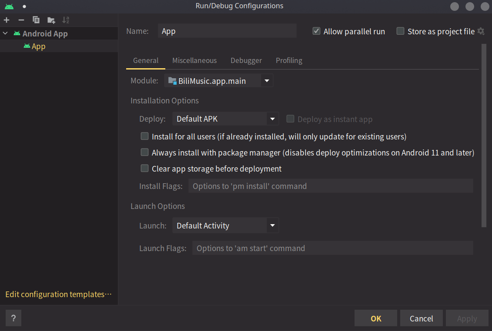

# BiliMusic

## 简介

这是一个用于”听视频“的音乐播放器，帮助您享受Live现场和独立创造者们的音乐。

## 如何使用

将Apk传入手机，安装后使用即可

## 从源代码构建

### 构建环境

- Java 11
- Gradle 7.4
- Android SDK 33 (编译对象为Android 30)

​	本项目使用 Android Studio 开发

### 如何构建

1. 下载源码

   ```bash
   git clone git@github.com:MoveCloudROY/BiliMusic.git
   ```

2. 使用 Android Studio 打开项目文件夹，设置项目的本机 SDK，具体可参考[此处](https://stackoverflow.com/questions/27620262/sdk-location-not-found-define-location-with-sdk-dir-in-the-local-properties-fil)，简要说明如下。

   - 在项目根目录创建 `local.properties` 文件

   - 向文件内写入 SDK 地址，具体格式如下。

     - Windows

       ```
       sdk.dir=C\:\\Users\\YourUserName\\AppData\\Local\\Android\\sdk
       ```

       将 `YourUserName` 替换成你的用户名，SDK 所在的文件夹可能为 `sdk` 或 `Sdk`，请您务必确认，如果你的 SDK 是自定义安装，请自行修改为你安装的文件夹。

     - MacOS

       ```
       sdk.dir = /Users/YourUserName/Library/Android/sdk
       ```

       将 `YourUserName` 替换成你的用户名

     - Linux

       ```
       sdk.dir = /home/YourUserName/Android/sdk
       ```

       将 `YourUserName` 替换成你的用户名，SDK所在的文件夹可能为 `sdk` 或 `Sdk`，因为Linux大小写敏感，请您务必确认。

3. 点击”构建“按钮（图中最左侧），开始构建项目

   

   > 目前项目存在一个 Warning，为 Room 库 Bug，在当前版本可忽视。

4. 设置 Configuration

   点击 `Add Configuration...` 设置运行设置，如下

   

5. 如果您在Device Manager中拥有设备，点击Play按钮，即可运行，若无，您可以参考[这里](https://developer.android.com/studio/run/managing-avds)进行设置。

## 开源许可

本项目使用MIT许可证开源。
